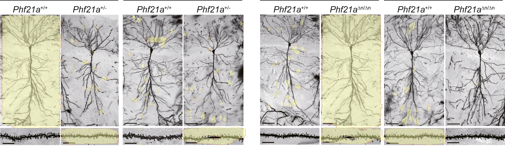
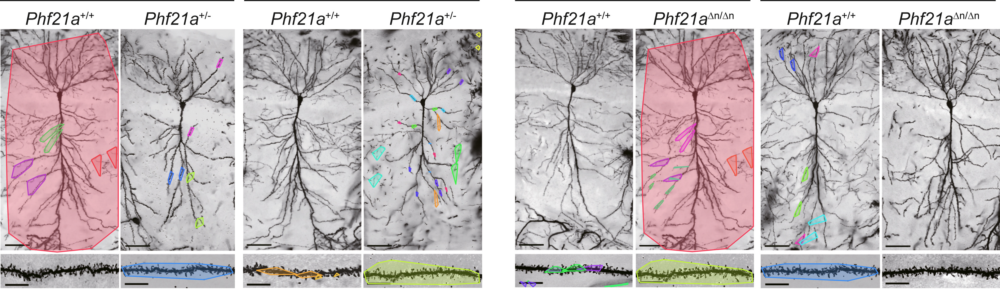

# Examples from my SHERLOQ version

## Complete Automatic Analysis

I exported the two illustrated results from my application. The microscopy
figure shows the combined analysis overlays. The texture example shows the
analysis of a version I edited, with the original before my edits alongside
it for visual comparison. These supplied exports are displayed unchanged.

## D2PRL on the microscopy figure

I supplied this D2PRL export from my application using the same input figure as
the [Complete Automatic Analysis example](../screenshots/fork/automatic-analysis-microscopy.png).
The yellow overlay highlights two large neuron panels and several regions in
the lower strip, as well as smaller areas elsewhere.

The supplied PNG is retained unchanged at 3226 × 936 pixels. This is a supplied
result, not a newly computed analysis for the gallery. Its inference device and
region-size setting were not recorded with the image.
[D2PRL controls and model](../macos/docs/D2PRL-INTEGRATION.md) ·
[Interactive region-size filter](../macos/docs/D2PRL-INTERACTIVE-FILTER.md).

## SIFT Panels and Text on the microscopy figure

I supplied this export from **SIFT + G2NN + RANSAC + Panels + Text** in Copy-Move
Forgery 2. It uses the same microscopy figure as the D2PRL example above.
The PNG is displayed unchanged at 3226 × 936 pixels.

The two large red envelopes and the smaller coloured groups show the extent of
retained geometric correspondences. The method details explain panel selection,
text exclusion and regrouping after RANSAC. No inference settings beyond the named
profile were supplied with this image. [Method and controls](../macos/docs/SIFT-PANELS-TEXT.md).

## Individual tool views

The four additional illustrations are actual SHERLOQ tool widgets rendered
from this repository, with a title and, where useful, a source-image viewer.
They demonstrate the tools' output and controls on these images.

| Tool | Input | Settings |
| --- | --- | --- |
| Channel Histogram | BBBC039 microscopy | Value channel, range 0–255, default linear display |
| Noise Separation | BBBC039 microscopy | Median, radius 1 px, equalized residual display |
| Frequency Split | Original texture | Separation 15%, smoothing 25%, threshold/filter off |
| Bit Planes Values | Original texture | Luminance, bit 5, filter disabled |

The microscopy source and the original texture are used directly for these
four demonstrations; the coloured automatic-analysis overlays are not used
as analysis inputs. Histogram, residual, frequency and bit-plane views are
exploration tools, not labels declaring an image altered.

To render these four panels again, use Python with the native installation's
dependencies and run `python examples/render_examples.py` from the repository
root. The script uses the repository's actual tool code and writes PNGs into
`screenshots/fork/`. Font rendering and timing labels can vary by machine.

## City photograph with an edit reference

The [Street Photo examples](street/README.md) add 21 actual tool views using my
original photograph, edited input and separate reference of changed areas.
Aligned crops make the clouds, signs and pedestrian easy to compare. The
reference is never supplied to a detector. Together with the spiral copy-move
examples, this covers the fourteen tools without using the coffee photographs
in the main gallery.

## Fourteen additional tools

The [extended examples](advanced/README.md) cover clone searches, ELA and its layers,
multiple compression, illuminant colour, isolated pixels, Noisesniffer, ZERO,
Adaptive CFA, TruFor, CAT-Net, SAFIRE, FOCAL and AdaIFL. They include the
input images, recorded settings and a script that runs the actual tools.

## Microscopy source and credits

`bbbc039-00809.png` is the unchanged `srcDataset/00809.png` file from the
[RSIID source archive](https://zenodo.org/records/15095089), credited to
João P. Cardenuto and Anderson Rocha, *Benchmarking scientific image forgery
detectors* (2022). RSIID is distributed under CC BY 4.0.

The underlying image is from **BBBC039v1**, Caicedo et al. (2018), available
from the Broad Bioimage Benchmark Collection, Ljosa et al. (2012).
[BBBC039's source page](https://bbbc.broadinstitute.org/BBBC039) places that
image collection under CC0. RSIID identifies this derived source crop as CC0;
the original source metadata is retained in `bbbc039-source.json`.

This is a fluorescence image of cell nuclei, not an AI-generated image.
The source filename identifies a converted crop; it is not the original
full-field 16-bit TIFF. No additional change was made to the supplied crop.

These credits apply to the BBBC039 image and the two panels using it;
the separately supplied microscopy analysis export is a different figure.

The [spiral reference gallery](spiral/README.md) compares my original, edited input
and supplied edit reference with actual Copy-Move Forgery 2 and ELA outputs.
