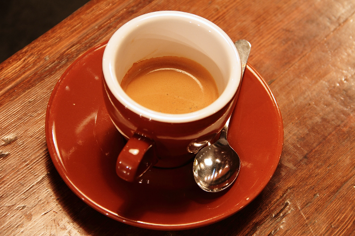
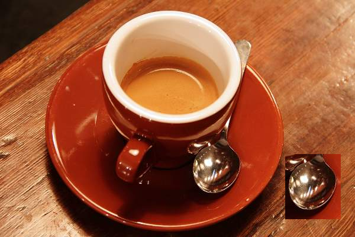

# Recorded spiral and earlier technical examples

For the current city photograph and its edit reference, see the [Street Photo gallery](../street/README.md). The spiral pair and its copy-move examples below remain in the main presentation.

I ran all fourteen tools below on my Apple Silicon installation and captured
23 views of their actual interfaces and results. The tool modules match the
source in this fork at revision `0cf050dbcf66859b654467401cfc53d8e864c323`.
These are demonstrations on a few images, not an accuracy benchmark.

The [main README gallery](../../README.md#screenshots) presents the texture
examples inside an expandable section. The coffee runs below are retained as
reproducible technical examples, outside the main presentation. The original SHERLOQ screenshots remain separately
credited to Guido Bartoli's project.

## Input photographs and edits

The coffee photograph is **Rachel Michetti's CC0 photograph**, taken courtesy
of Pikolo Espresso Bar and distributed as
[`skimage.data.coffee()`](https://scikit-image.org/docs/stable/api/skimage.data#skimage.data.coffee).
It is a real photograph, 600 × 400 pixels. I used explicit pixel operations to
prepare these examples. No generative-image model was used to make the coffee
photograph or its edited variants.

| Original | Copy added at the lower right |
| --- | --- |
|  |  |

- `coffee-original.png`: the original decoded photograph.
- `coffee-copy.png`: JPEG quality 65 encode/decode, followed by a rectangular
  copy from `(x=320, y=232, width=94, height=110)` to `(x=482, y=260)`.
  This includes the spoon and surrounding pixels. The displacement changes
  the alignment of the JPEG grid carried by that patch.
- `coffee-copy.jpg`: the edited image saved again at JPEG quality 95.
- `coffee-copy-mask.png`: the destination rectangle in white. It records the
  operation and was **not supplied to the detectors**.
- `coffee-double.jpg`: JPEG quality 65 encode/decode, then quality 95, without
  the copied patch. Both compressions use the same grid alignment.
- `coffee-pixels.png`: ten isolated pixels set alternately to white and black
  on the original photograph. Coordinates are in `input-operations.json`.

`prepare_inputs.py` reproduces these operations with scikit-image, OpenCV and
NumPy. JPEG bytes may vary with the installed codec, so the input files used
for the published captures are included here as well.

## My edited texture

`texture-edited.png` contains the 1254 × 1254 decoded colour pixels from my
edited TIFF, saved as PNG without additional image compression loss. It does
not contain the coloured SHERLOQ annotations. I used it directly for
Copy-Move Forgery 2, Automatic Clone Search and both ELA views.

| Original | Edited input | My edit reference |
| --- | --- | --- |
|  |  |  |

I also supplied a separate reference showing the areas I changed. It is used only
for presentation, never as detector input. See the [aligned spiral comparisons](../spiral/README.md).

These texture images are my supplied example material; the Rachel Michetti
CC0 credit above applies only to the coffee photograph and its derivatives.

## Methods, settings and observations

The complete control values, status text, input SHA-256 hashes and tool-module
SHA-256 hashes are retained in [analysis-records.json](analysis-records.json).
The following table describes the published runs. Default parameters were
used except for the displayed view selections and the Illuminant cell size.

| Tool | Input and settings | What this run shows |
| --- | --- | --- |
| Copy-Move Forgery 2 | Edited coffee PNG and edited texture; PatchMatch Zernike, 6,000 displayed links, 8 iterations | Grouped correspondences between repeated regions; 2 displayed biomes on coffee and 9 on the texture |
| Automatic Clone Search | Same two PNGs; Extended Zernike + SIFT + Mirror, plus Forgeryscope | Both branches complete; Extended supplies the groups (11 on coffee, 22 on the texture), while Forgeryscope returns no supported pair |
| ELA and layers | Coffee JPEG and texture PNG; classic quality 75, scale 50%, contrast 20%; Conservative layered profile | Classic differences and energy/cell overlays; layers use JPEG-table quality 95 on coffee and fallback quality 75 on the texture |
| Multiple Compression | Double JPEG, quality 65 then 95 | Recompression curve plus compatible double-JPEG traces supported by 8 of 9 frequencies; the candidate quantization step is not a recovered JPEG quality |
| Illuminant Map | Original coffee; Shades of Gray p=6, 32 px cells, linearized sRGB, dark/clipped pixels excluded | 234 of 247 valid cells; local colour estimates affected by the scene's coloured surfaces |
| Dead / Hot Pixels | Coffee with ten injected pixels; 3 × 3 neighbourhood, minimum deviation 32, maximum neighbour range 32 | 28 candidate pixels in overlay and mask views; the count includes natural image details |
| Noisesniffer | Edited coffee PNG; default parameters | Two marked regions, mainly around the cup and plate; this output does not clearly localize the copied spoon |
| ZERO | Edited coffee PNG; missing-grid search enabled | One foreign-grid region around the copied spoon, main grid (0,0); region and grid-vote views |
| Adaptive CFA | Edited coffee PNG; CPU, default parameters | A broad inconsistency map, without a clean outline of the copied patch |
| TruFor | Edited coffee JPEG; GPU | Localized anomaly map and separate confidence map; image score 0.998 in this run |
| CAT-Net v2 | Edited coffee JPEG; Metal | Heatmap response around the copied spoon, also responding to some original image details |
| SAFIRE | Edited coffee PNG; Metal, three clusters | Different source-consistency groups, including a small cluster around the copied spoon |
| FOCAL | Edited coffee PNG; Metal | A selected cluster around the copied patch |
| AdaIFL | Edited coffee PNG; CPU | Heatmap response around the copied area |

Colour overlays and model scores are method outputs. For example, ELA also
responds to natural edges, SAFIRE colours identify clusters, and isolated-pixel
candidates do not establish sensor damage. These examples show the actual
differences between methods, including outputs that do not isolate the edit.
Method and model authors are credited in the
[component attribution](../../macos/docs/ATTRIBUTION.md).

## Reproduce the captures

Use the complete native installation with its supplied environments, native
libraries and model weights. Copy this directory to a working folder if you
want to keep the checked-in example files unchanged. Set `SHERLOQ_NATIVE_ROOT`
to the extracted and restored installation directory, which contains `source/`
and `venv/`, then run its Python interpreter:

```sh
export SHERLOQ_NATIVE_ROOT="/path/to/SHERLOQ-installation"
for tool in cloning2 automatic_clones ela multiple illuminant defect_pixels noisesniffer zero adaptive_cfa trufor catnet safire focal adaifl; do
  "$SHERLOQ_NATIVE_ROOT/venv/bin/python" render_extended.py "$tool"
done
for tool in cloning2 automatic_clones ela; do
  "$SHERLOQ_NATIVE_ROOT/venv/bin/python" render_extended.py "$tool" texture-edited.png texture
done
```

The script renders the actual Qt tool panels offscreen, waits for their jobs
to finish, and writes screenshots and JSON records beside itself. Tools with
multiple illustrated views produce additional captures. Where available,
numeric result arrays are also saved locally as NPZ files. It does not use the
reference mask during inference. Runtime, fonts and some clustering/matching
results can vary between runs and machines; this is not a bit-exact screenshot
or performance test.
