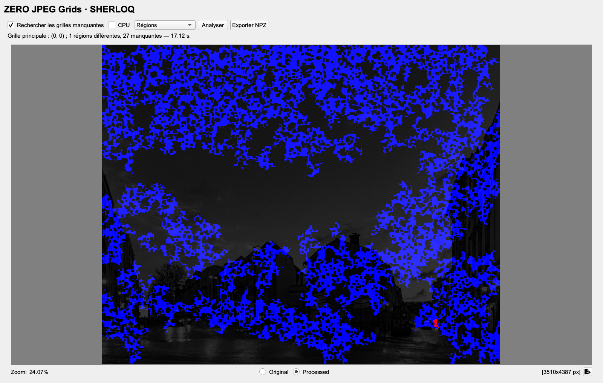
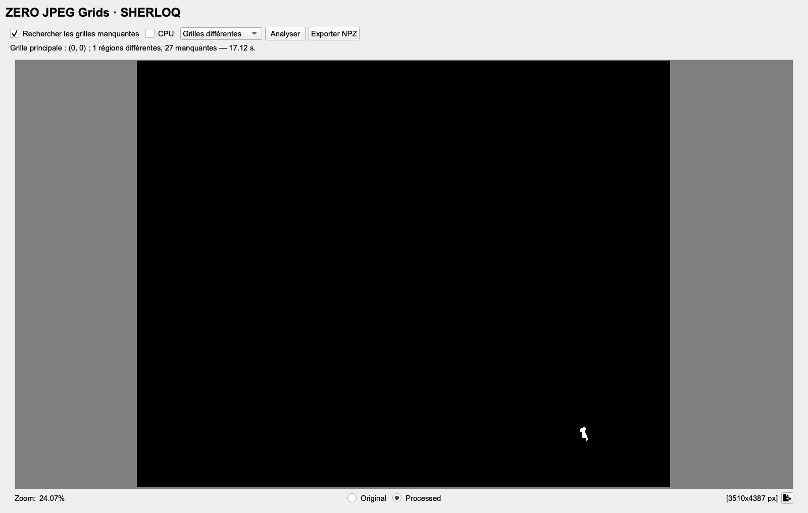
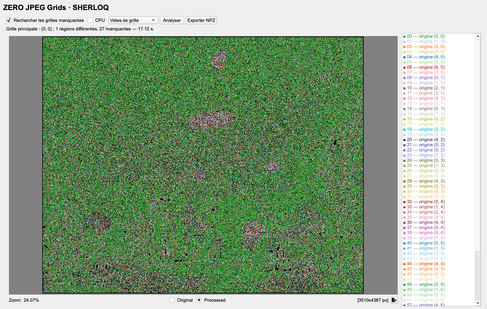
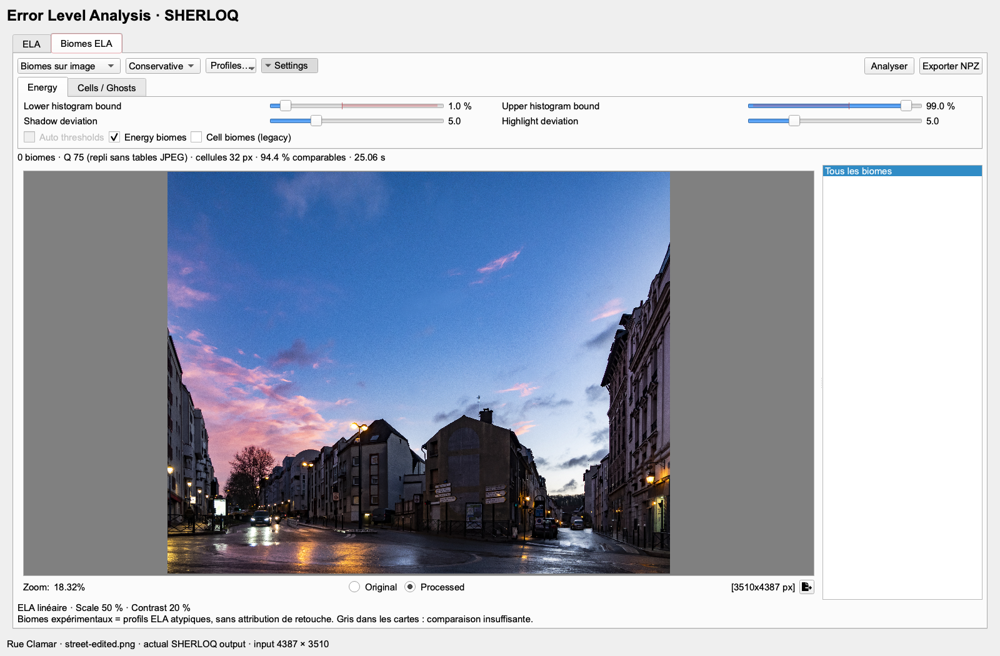
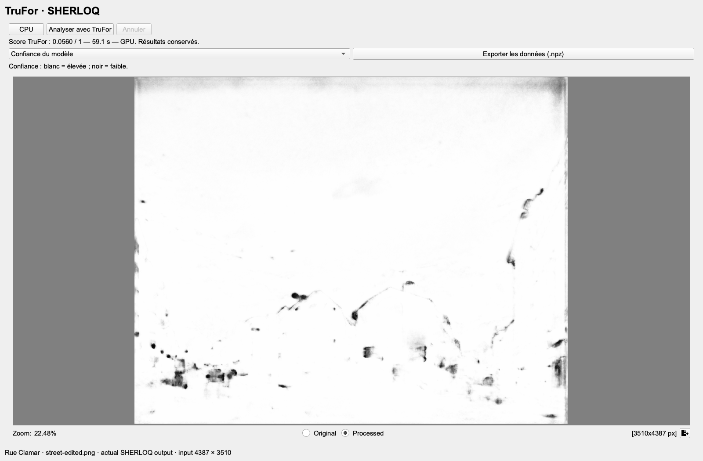
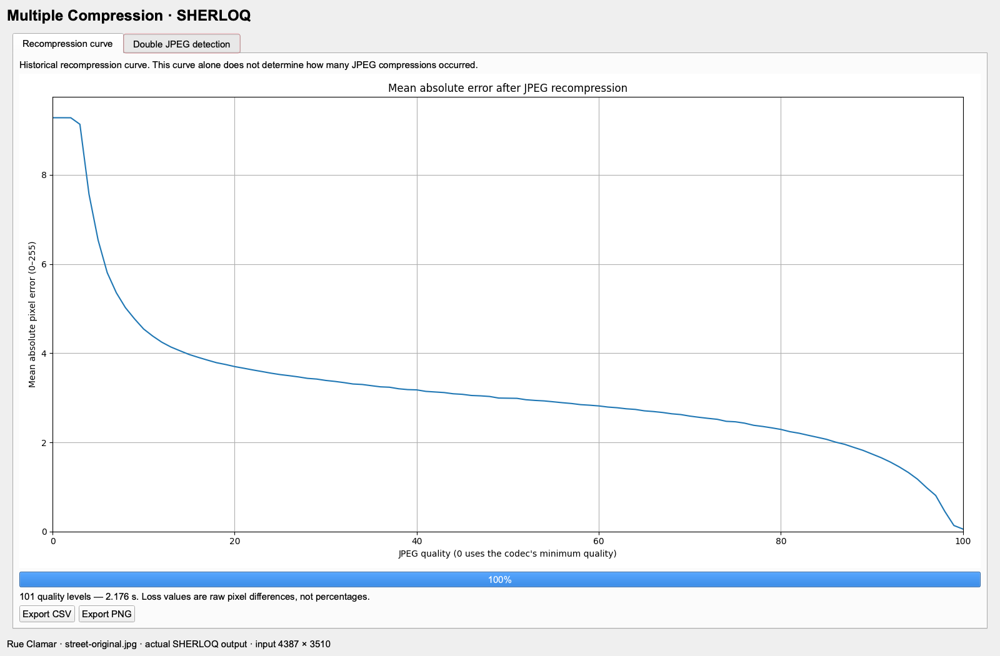
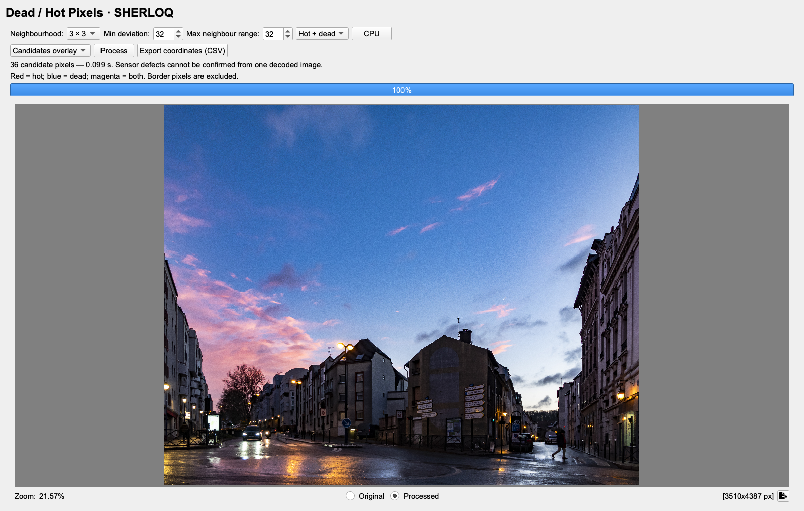
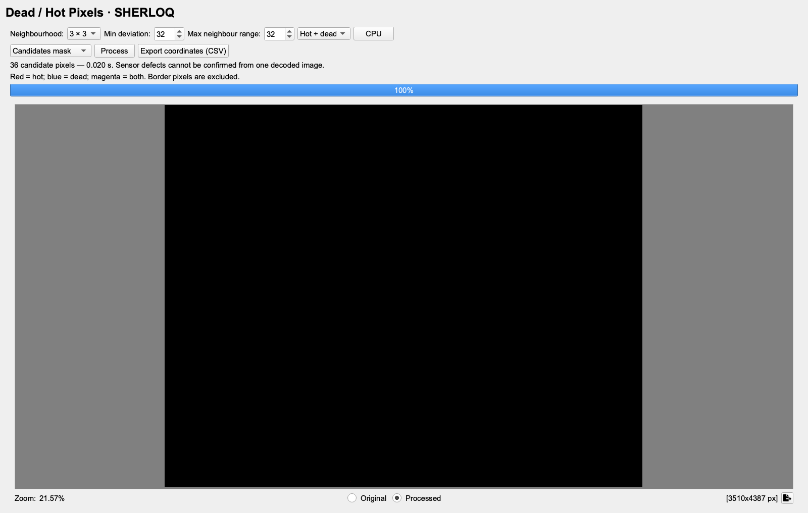

# Rue Clamar — my original, edited input and edit reference

I supplied three versions of this photograph: the original JPEG, my edited TIFF,
and an image showing the areas I changed. The reference is displayed for comparison;
**it was never supplied to any detector**. The input to the manipulation analyses
is the edited TIFF's decoded 4387 × 3510 colour image, saved losslessly as PNG.
The source photographs and edits are my example material.

| Original | Edited input | My edit reference |
| --- | --- | --- |
|  |  |  |

Full-resolution files: [original JPEG](street-original.jpg),
[edited pixels](street-edited.png), [edit reference](street-reference.jpg).
The previews above are resized for reading; the analyses use the full-resolution
inputs. Some research methods resize internally, as recorded below.

## Read the result alongside the actual changes

These three crops use exactly the same coordinates in all four columns. They
show removed clouds, removed signs and the removed pedestrian. The last column
is CAT-Net's real displayed result, without adding the reference to its output.


This is a worked example on one photograph, not a general accuracy ranking.
The methods give different results; an unmarked edit is still an edit, and a
marked area may also be an unchanged part of the photograph.

## CAT-Net v2

Several strong responses coincide with the referenced sky, sign and pedestrian
edits. There are also responses outside the reference. The input is PNG, so the
integration creates a JPEG quality-100 4:4:4 companion for its JPEG coefficients;
this is not an analysis of the TIFF's nonexistent JPEG coefficient stream.
Metal, original 4387 × 3510 input; native output map 1098 × 878.


## SAFIRE

With three source-consistency groups, the green group isolates the large edited
patch in the middle of the sky. Other edits are not cleanly separated. The colours
identify clusters, not probabilities of editing. Metal, three clusters,
16 prompts per side; the model works internally at 1024 × 1024.


## ZERO JPEG Grids

The run reports one foreign-grid region and 27 missing-grid regions. The red
foreign-grid response lies within the removed pedestrian's former position.
Blue missing-grid responses are much more widespread and do not delineate the
edits. This zoom changes only the displayed view, not the full-image analysis.


<details>
<summary>ZERO — whole image, foreign-grid mask and grid votes</summary>





</details>

## ELA and layers

The central edited sky patch is visible in the layered output. The output also
contains other scene-dependent responses. Classic ELA uses quality 75, scale
50%, contrast 20%; the layered Conservative profile uses fallback quality 75
because the PNG contains no JPEG quantization tables.


<details>
<summary>ELA — energy layer without the legacy cell overlay</summary>



</details>

## Noisesniffer

Default settings produce 107 regions. The central sky edit is among the marked
areas, but large parts of the sky and buildings are also marked. This is useful
for comparing noise structure; it does not cleanly isolate all the retouches.


## Adaptive CFA

CPU, Original model, 32-pixel blocks. The map is distributed across the scene
and does not form a clean outline of the reference edits in this example.


## TruFor

The reported image score is 0.0560 in this run. Its map responds strongly around
several lights and edges but does not clearly recover the edit reference.
The confidence map is a separate output. GPU, full-resolution input.


<details>
<summary>TruFor — confidence map</summary>



</details>

## FOCAL

The selected cluster mainly covers part of the left-hand buildings and road.
It does not match the supplied edit reference. Metal, ViT-L + HRNet, internal
1024 × 1024 input and 64 × 64 output grid.


## AdaIFL

The overlay is very weak in this run and does not visibly delineate the known
edits. CPU, AdaIFL v0, internal 1024 × 1024 input and 64 × 64 output grid.


## Multiple Compression — original JPEG

This tool uses the **original JPEG**, because the edited TIFF has no stored JPEG
coefficients. The recompression curve is followed by the experimental double-JPEG
view. The latter is **inconclusive: 0 of 9 frequencies support a consensus**.
The earlier compression count is not known from this result.




## Illuminant Map — original photograph

Shades of Gray, p=6, 32-pixel cells, linearized sRGB, dark/clipped pixels excluded.
The blue sky and warm lighting are easy to locate in the colour estimates;
surface colours also affect them. 15,168 of 15,180 cells are valid. This view
illustrates local colour estimation, not a segmentation of the retouches.


## Dead / Hot Pixels — original photograph

The tool finds 36 isolated-pixel candidates using a 3 × 3 neighbourhood,
minimum deviation 32 and maximum neighbour range 32. This enlarged example
shows a candidate among fine tree details. No pixels were injected into this
photograph; the candidates do not establish physical sensor defects.


<details>
<summary>Isolated pixels — full overlay and mask</summary>




</details>

## Copy-move examples on my spiral texture

The spiral's before/after pair and actual **Copy-Move Forgery 2**, **Automatic
Clone Search** and ELA captures are retained in the
[spiral gallery](../../README.md#screenshots) and [recorded texture runs](../advanced/README.md#my-edited-texture).
Together these examples cover the fourteen requested tools with the spiral and
city photograph. The older coffee demonstrations remain in the technical archive.

## Reproduce and inspect

[Analysis records](analysis-records.json) retain settings, status text, source
file hashes and available model metadata. [Manifest](manifest.json) records
the published files, decoded input dimensions and tool-module hashes.
[Crops](comparison-crops.json) gives the coordinates used in the comparison.
The edited PNG was recompressed losslessly for distribution; its decoded pixels
were checked for exact equality, and the recorded and published file hashes are
both provided.

Use the complete native installation and its model weights, with both published
RC1 corrections applied. Copy this example directory to a working folder, then:

```sh
export SHERLOQ_NATIVE_ROOT="/path/to/SHERLOQ-installation"
for tool in ela noisesniffer zero adaptive_cfa trufor catnet safire focal adaifl; do
  "$SHERLOQ_NATIVE_ROOT/venv/bin/python" render_street.py "$tool" street-edited.png
done
for tool in multiple illuminant defect_pixels; do
  "$SHERLOQ_NATIVE_ROOT/venv/bin/python" render_street.py "$tool" street-original.jpg
done
```

The renderer captures actual Qt widgets and waits for their computations. It
also saves available arrays locally as NPZ and display outputs as PNG. The
reference image is never opened by that renderer. Display zooms do not crop the
analysis input. Runtime, fonts and model results can vary across environments.
Research-method credits remain in [the component attribution](../../macos/docs/ATTRIBUTION.md).
